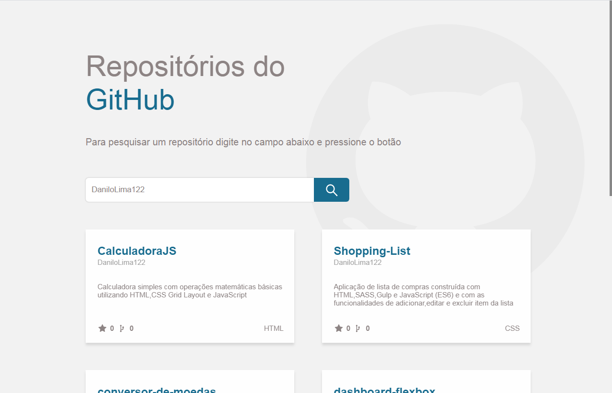

## Pesquisa repositórios API GitHub 😄
#### Aplicação que busca repositorios na API do GitHub

## Tecnologias utilizadas

- ReactJS
- Styled Components
- NPM

## Começando

Para explorar o projeto na sua máquina primeiro certifique-se que você tem o Git e o Node.JS instalado, se não tiver acesse os links na seção LINKS, para baixar.

1º- Com o git pré-instalado clone o projeto:

~~~shell
git clone https://github.com/DaniloLima122/repos-github-ReactJS.git
~~~

2º - Navegue até o diretório da pasta que você clonou no passo anterior.

3º - Instale as dependências do projeto digitando o seguinte no seu terminal:
~~~shell
npm install
~~~

4º - Abra a pasta que você clonou no seu editor de preferência

5º - Agora é só abrir o projeto no seu navegador digitando no seu terminal:
~~~shell
npm start
~~~

## Contribuições

Fique a vontade para avaliar dando uma "star" ou contribuir com o projeto e reportar sobre bugs e dar sugestões de melhorias.

## Links

- Instalação do [Git](https://git-scm.com/)
- Instalação do [Node.js](https://nodejs.org/en/download/) 

## Licença
- [MIT](LICENCE.md)

